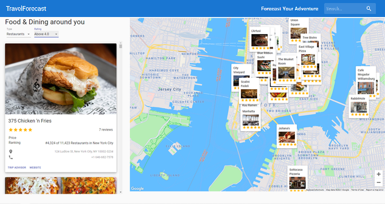

<h1>🗺 Travel Forecast 🗺</h1>

### Explore all information about Restaurants, Hotels and Attractions around you 🔍 🗺

### Link :link: https://travelforecast.netlify.app/

## Introduction

An advanced Travel Companion Application using Google Maps. With Geolocation, Google Maps API, Searching for places, Fetching restaurants, hotels and attractions based on location from specialized Rapid APIs, data filtering and much more, this Travel Forecast App is your one stop trip itinerary planner.

- Advanced React Best Practices such as folder & file structure, hooks and refs
- User Interface based on Material UI
- Google Maps API
- Fetching data from unlimited sources using RapidAPI

Setup: run `npm i && npm start` to start the development server

Note: You need to add API keys (wherever required) for the app to work
